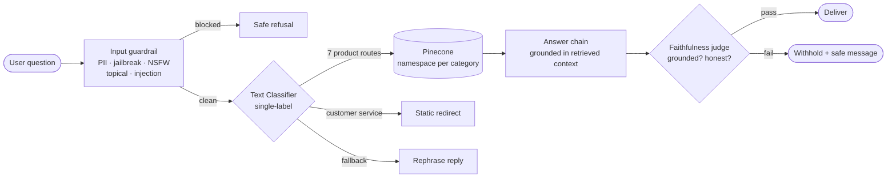
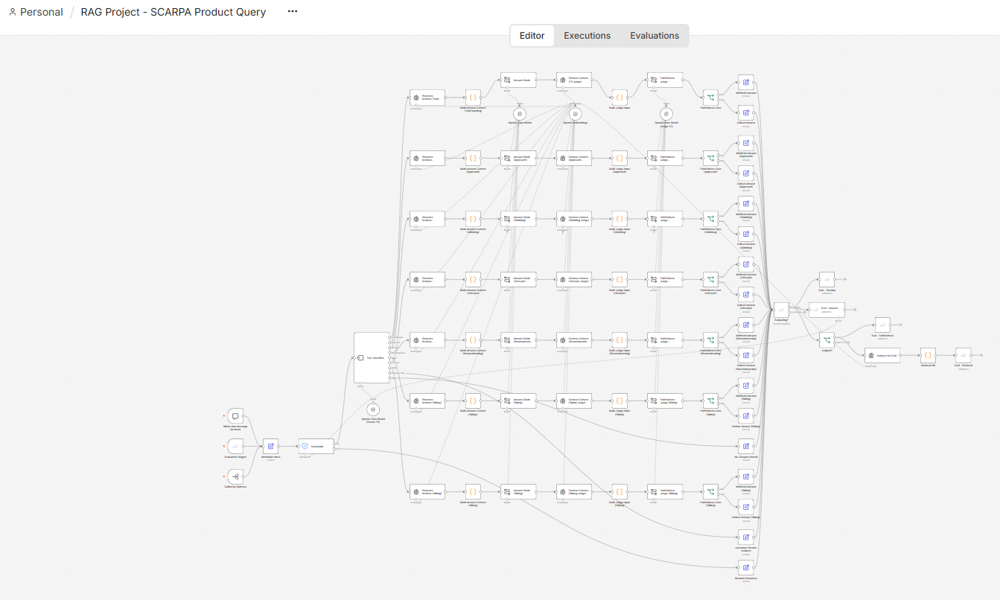

# SCARPA RAG Agent

**RAG Systems Case Study | Retrieval · Guardrails · Evaluation | n8n · Pinecone · OpenAI**

A natural-language agent that answers questions about SCARPA's footwear catalog by retrieving from a real vector database instead of guessing from a model's memory. It was first prototyped in ChatGPT's Agent Builder, then **rebuilt in n8n** against a real Pinecone index and a real evaluation harness — because the goal was never a demo. It was to understand *why* each part of a RAG system has to be there by building it, breaking it, measuring it, and fixing what the measurements exposed.

---

## Table of Contents

- [🎯 Outcomes](#-outcomes)
- [🧱 What I Built](#-what-i-built)
- [🔀 How It Routes](#-how-it-routes)
- [🛡️ Guardrails](#-guardrails)
- [📊 Evaluation](#-evaluation)
- [🧩 The Sibling-Variant Bug — A Worked Fix](#-the-sibling-variant-bug--a-worked-fix)
- [🗺️ Gap Audit](#-gap-audit)
- [🧠 What I Took Away](#-what-i-took-away)
- [🌱 From Prototype to Rebuild](#-from-prototype-to-rebuild)
- [🔧 Stack](#-stack)
- [📁 Repository](#-repository)
- [📄 Disclaimer](#-disclaimer)

---

## 🎯 Outcomes

Every number below comes from an **evaluation harness built into the workflow** — 50 curated questions run through the live pipeline twice (100 executions), scored automatically. Not a spot check.

| Metric | Baseline | After remediation | What it means |
|--------|----------|-------------------|---------------|
| **Routing accuracy** | 93.8% | **~97%** | The right question reaches the right product category |
| **Faithfulness pass rate** | 81.8% | **96.7%** | Answers are grounded in retrieved data, not invented |
| **Withhold rate** | 18.2% | **3.3%** | How often a correct answer is wrongly held back |
| **Run-to-run stability** | 2 of 5 probes flaky | **50/50 stable** | Same question, same answer, every time |
| **Missed-hallucination rate (judge)** | 0.125 | **0** | The output guardrail no longer lets a wrong spec through |

> The headline result isn't a single number — it's that a probabilistic system was made **measurable, debuggable, and steadily better** by treating evaluation as a first-class part of the build.

The two hardest defects — a retrieval bug that answered with a sibling product's spec, and an output judge that over-blocked correct answers about those same siblings — were both **closed**. The [worked fix](#-the-sibling-variant-bug--a-worked-fix) is below.

---

## 🧱 What I Built

A six-stage retrieval pipeline orchestrated in n8n. A question enters, passes an input guardrail, is classified into one of eight routes, hits a category-specific slice of the vector store (or a non-retrieval branch), is checked for faithfulness against the retrieved data, and is delivered — or, in evaluation mode, scored.



*Conceptual flow above. Below — the actual n8n graph: the classifier fans out into **seven parallel category branches** (namespace sharding, made literal), each running the same retrieve → answer → judge → gate sequence, all converging on the evaluation scorer.*



| Step | Component | What it does |
|------|-----------|--------------|
| 1 | Prompt entry | A chat trigger takes the question; an evaluation trigger shares the same entry point |
| 2 | Input guardrail | Screens for PII, jailbreak, NSFW, topical alignment, and prompt injection |
| 3 | Classifier | Single-label routing to one of seven product categories, a customer-service intent, or a fallback |
| 4 | Retrieval / redirect | Product routes query a category namespace in Pinecone; customer-service skips retrieval entirely |
| 5 | Output guardrail | A per-category faithfulness judge verifies the answer is grounded in the retrieved context |
| 6 | Delivery | Validated answer returned; in evaluation mode it is scored instead |

**The data layer.** SCARPA's product catalogs (83 products across seven lines) were converted to markdown and embedded into **a single Pinecone index**, **sharded by category using one namespace per product line**. Retrieval is scoped to the namespace the classifier picked — so a climbing question only ever searches climbing inventory. The namespace *is* the context boundary. → [`docs/architecture.md`](docs/architecture.md)

---

## 🔀 How It Routes

Routing is a **deterministic classifier-plus-switch**, not an autonomous agent. The classifier emits exactly one category; a switch sends the query down exactly one branch. That determinism is the point — it makes behavior predictable, debuggable, and measurable.

Two of the eight branches never touch the vector store:

- **Customer Service redirect** — price, availability, where-to-buy, orders, returns, warranty, or fit *advice* are legitimate but unanswerable from a spec catalog. They route to a static redirect, bypassing retrieval and the judge, because a fixed message is grounded by construction.
- **Fallback** — anything the classifier can't confidently place returns a short "I can help with these categories — could you rephrase?" reply.

A subtle distinction lives here: **"what sizes does the Crux come in?" is a spec question** (in the catalog → Approach), while **"do the Crux run large?" is fit advice** (not in the catalog → Customer Service). The classifier prompt encodes that split explicitly. → [`docs/routing.md`](docs/routing.md)

---

## 🛡️ Guardrails

Guardrails sit at both ends, addressing different failure modes.

**Input guardrail (before routing).** Five checks: PII, jailbreak, NSFW, topical alignment, and prompt injection. Anti-injection instructions are also baked into every answer-chain prompt as defense in depth.

**Output guardrail (after answering).** A per-category **faithfulness judge** compares the generated answer against the retrieved context and passes only grounded answers and honest non-answers, failing invented or contradicted facts. A gate then either delivers the answer or withholds it with a safe message.

The judge is calibrated to the agent's actual answer mode. This agent doesn't only extract facts — it also makes **grounded recommendations** ("the Crux is a good pick for talus because…"). The judge has to pass that kind of answer while still catching a hallucinated spec, which is a narrower target than "every sentence must be a verbatim fact." → [`docs/guardrails.md`](docs/guardrails.md)

---

## 📊 Evaluation

Evaluation is built into the workflow as a first-class artifact, not bolted on afterward.

- An **evaluation trigger** reads 50 questions from an n8n Data Table and feeds them through the *same* pipeline entry point as live chat (via a shared Normalize Input step), so the eval exercises real behavior, not a parallel mock.
- A `checkIfEvaluating` gate keeps live chat from hitting the metric nodes.
- Each row is scored on **routing accuracy** (did it reach the right category?) and **answer correctness** (does the response match the expected fact or behavior?), plus faithfulness pass/withhold rates and per-row stability across repeats.
- The dataset covers straightforward spec lookups, grounded recommendations, honest non-answers, name-family collisions, gender-variant columns, the customer-service redirect, and deliberately-unsupported edge cases. → [`eval/eval_questions.csv`](eval/eval_questions.csv)

Testing repeatedly earned its keep. Building the customer-service route, for example, surfaced two issues invisible until exercised end-to-end: the input guardrail was silently blocking legitimate pricing questions *before* they could be routed, and the classifier was multi-labeling (returning two routes at once). Both were caught by running real queries and reading which terminal node fired — not by inspecting the graph. → [`docs/evaluation.md`](docs/evaluation.md)

---

## 🧩 The Sibling-Variant Bug — A Worked Fix

The most instructive failure in the project. Worth walking through, because the fix was *not* where the instinct said it would be.

**📉 The symptom.** Asked "how much does the Ribelle Cross 2 weigh?", the agent answered with the weight of the *Ribelle Cross 2 Mid GTX* — a different shoe. The catalog has three near-identical siblings: `Ribelle Cross 2`, `Ribelle Cross 2 GTX`, and `Ribelle Cross 2 Mid GTX`.

**⚠️ The false trail.** The obvious fix is prompt engineering — tell the answer chain and the judge to respect product boundaries. I gave all fourteen prompts explicit "never borrow a sibling's value" rules. **They still failed.** That negative result was the evidence: the problem wasn't the prompts.

**🔑 The real cause — ingestion, not prompts.** The markdown was chunked at a fixed size, which split product records mid-record. The exact-name match (`Ribelle Cross 2`, 325g) was ranking *below* two longer sibling variants whose names contain the base name as a substring, and only that record still carried its `##` heading — the others began with a bare product name. The model was reading specs off the wrong record.

**🛠️ The fix, in two parts.**
1. **Re-chunk deterministically** — one product record per chunk, heading preserved, model name stored as vector metadata. (Measured first: the largest of 83 records is 1,221 characters, so a one-record-per-chunk split is exact.)
2. **Recalibrate the output judge** — tuned against a *fresh* dev set of sibling cases, then measured on a *quarantined* held-out set never used for tuning, so the improvement was real generalization rather than overfitting.

**✅ Result.** "How much does the Ribelle Cross 2 weigh?" now returns **325g / 390g** — the correct base model — grounded and judge-approved. The retrieval bug and the judge over-block were both closed, and the end-to-end withhold rate dropped from 6.5% to 3.3%. → [`docs/lessons-learned.md`](docs/lessons-learned.md)

---

## 🗺️ Gap Audit

A structured audit mapped where the design holds and where it has edges. Some gaps were fixed; others are **documented architectural boundaries** — known limits that are honest about themselves rather than papered over.

| Gap | Description | Disposition |
|-----|-------------|-------------|
| A | Cross-category comparison ("Ribelle Run vs Ribelle Cross") | **Documented boundary** — a single-route classifier can't retrieve from two namespaces; degrades to "which line did you mean?" |
| B | Sparse-data / unanswerable specs (e.g. Maestrale RS flex) | **Fixed** — admits the spec isn't available instead of inventing one |
| C | Name-family collisions (Mojito vs Mojito Wrap; Ribelle Cross siblings) | **Fixed** — disambiguates within a namespace (see the worked fix above) |
| D | Non-catalog questions (price, stock, fit advice) | **Fixed** — dedicated customer-service redirect |
| E | Gender-variant columns (men's vs women's specs) | **Fixed** — selects the correct column |
| F | Aggregation / list queries ("which boots are GORE-TEX?") | **Documented boundary** — exhaustive enumeration exceeds reliable top-k retrieval |

---

## 🧠 What I Took Away

The architecture was the starting point. The interesting part was working through *why* it has to look that way.

- **Retrieval-Augmented Generation** — grounding output in retrieved data rather than the model's parametric memory. The agent answers from the catalog, not from what the model "knows" about SCARPA.
- **Context pollution is real** — more retrieved context isn't automatically better. Irrelevant or near-duplicate chunks compete with the right one and degrade answers. Namespace sharding isn't just an optimization; it protects the model from itself.
- **The bug is often upstream of where it shows up** — a wrong *answer* traced back to *ingestion*. No amount of prompt engineering fixes a chunking problem.
- **Evaluation is the product** — a probabilistic system you can't measure is a system you can't improve. The harness is what turned "it feels better" into "withhold rate 6.5% → 3.3%."
- **Guard against your own tuning** — the output judge scored perfectly on its tuning set and worse on held-out cases. Tuning against a fresh dev set and measuring on a quarantined set is what kept the numbers honest.

---

## 🌱 From Prototype to Rebuild

The first version lived in **ChatGPT's Agent Builder** — a fast way to model the workflow and confirm the concept, but a prototyping environment, not a deployment platform. That prototype keeps its own home: **[`scarpa-rag-agent`](https://github.com/chasebarrett/scarpa-rag-agent)**.

**This repository is the rebuild** — a deliberately different tier of work. Moving to **n8n** meant a real classifier node, a real vector store with namespace sharding, a real faithfulness-judge cluster, and an evaluation harness wired into the same pipeline. The concepts — RAG, classification routing, guardrails, evaluation — are stack-agnostic; doing them against real infrastructure is where the understanding compounded, and where every number in the [Outcomes](#-outcomes) table came from.

---

## 🔧 Stack

| Tool | Purpose |
|------|---------|
| **n8n** | Workflow orchestration and routing |
| **Pinecone** | Vector store — single index, namespace-per-category sharding |
| **OpenAI** | `text-embedding-3-small` embeddings; GPT models for classification, answering, and judging |
| **Markdown** | Product-catalog source format |
| **n8n Data Table + Evaluation nodes** | Built-in evaluation harness (routing + answer metrics) |

---

## 📁 Repository

```
scarpa-rag-n8n/
├── README.md                              # You are here
├── LICENSE
├── data/                                  # Markdown product catalogs (one per category)
├── eval/
│   └── eval_questions.csv                 # The 50-question evaluation dataset
├── docs/
│   ├── architecture.md                    # The pipeline in detail; sharding rationale
│   ├── routing.md                         # Classifier design, single-label, the size-vs-fit split
│   ├── guardrails.md                      # Input checks; the faithfulness judge and its calibration
│   ├── evaluation.md                      # Harness design, the metrics, how to run it
│   └── lessons-learned.md                 # The sibling-variant fix and the conceptual takeaways
└── assets/
    ├── scarpa_agent_architecture.svg      # Conceptual flow diagram
    └── n8n_canvas.png                      # Screenshot of the real n8n graph
```

---

## 📄 Disclaimer

This is a personal portfolio project built to explore RAG and agent-workflow concepts. It is not affiliated with, endorsed by, or sponsored by SCARPA.

Product names, descriptions, and specifications under `data/` are the intellectual property of SCARPA S.p.A. and are included here solely for educational and portfolio purposes. The product data is not licensed for redistribution or commercial use.

The workflow design, architecture, evaluation harness, and accompanying documentation are my own work.
