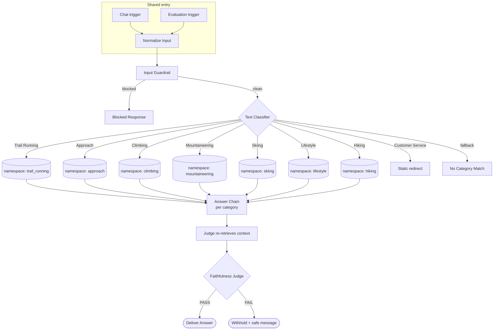

# 🏗️ Architecture

How the pipeline is put together, and the reasoning behind the two decisions that shape everything else: **single index + namespace sharding**, and a **shared entry point** for chat and evaluation.

← [Back to README](../README.md)

---

## The six stages

Every product route is the same shape: **retrieve → build answer context → answer → re-retrieve for the judge → judge → gate → deliver/withhold.** Seven parallel copies of that shape, one per category, plus two non-retrieval branches (Customer Service, fallback).

---

## 🗂️ The data layer: one index, seven namespaces

SCARPA's catalogs — **83 products across seven product lines** — were converted to markdown and embedded with `text-embedding-3-small` (1536 dimensions, cosine) into **a single Pinecone index**, partitioned into **one namespace per product line**.

Retrieval is always scoped to the namespace the classifier selected. A climbing question searches climbing inventory and nothing else.

**Why sharding instead of one undifferentiated index?** Because *the namespace is the context boundary.* A single flat index would let a "Ribelle" trail-running shoe compete for retrieval slots against a "Ribelle" mountaineering boot on every query. Sharding by category, gated by a classifier that runs *before* retrieval, means the model never sees the wrong category's inventory in the first place. It's the cheapest, most reliable way to prevent context pollution — you don't filter it out after the fact, you never let it in.

The trade-off is honest and documented: a single-route classifier **cannot** answer a question that spans two namespaces (see [Gap A in the gap audit](../README.md#-gap-audit)). That's the price of the boundary, and the design owns it rather than pretending otherwise.

---

## 🔗 One entry point for chat and evaluation

The most important structural decision after sharding: **the evaluation harness and live chat enter the pipeline through the same door.**

Both the chat trigger and the evaluation trigger feed a shared `Normalize Input` step, and everything downstream is identical. A `checkIfEvaluating` gate near the end is the *only* place the two paths diverge — it routes evaluation runs to the metric-scoring nodes and keeps live chat out of them.

This matters more than it looks. If the eval ran through a parallel copy of the pipeline, it would be measuring a mock, and every "the tests pass" would be a lie the moment the copy drifted from reality. Sharing the entry point means the eval exercises the exact classifier, the exact retrieval, and the exact judge that a real user hits. → [`evaluation.md`](evaluation.md)

---

## 🧩 Chunking: one product record per chunk

The ingestion side embeds each catalog by splitting it into chunks and upserting them to the category's namespace. The chunking rule is deliberately strict: **one product record per chunk, with its `##` heading preserved, and the model name stored as vector metadata.**

This wasn't the original design — it's the fix for the project's hardest bug, where a fixed-size split was cutting product records in half and letting sibling variants bleed into each other's answers. The full story is in [`lessons-learned.md`](lessons-learned.md); the short version is that the largest of the 83 records is 1,221 characters, so a one-record-per-chunk split is *exact* and eliminates the ambiguity at the source.

`clearNamespace` is set on every insert, so re-ingestion is idempotent and reversible — the index can be rebuilt from the markdown at any time without leaving stale vectors behind.

---

## Node map (per product route)

| Node | Role |
|------|------|
| `Pinecone Retrieve (<category>)` | Similarity search in the category namespace; feeds the answer |
| `Build Answer Context (<category>)` | Assembles retrieved chunks into the answer prompt |
| `Answer Chain (<category>)` | Generates the grounded answer (temperature pinned to 0) |
| `Retrieve Context (<category> Judge)` | Independent re-retrieval for the judge |
| `Build Judge Input (<category>)` | Packages question + answer + context for the judge |
| `Faithfulness Judge (<category>)` | PASS / FAIL verdict on groundedness |
| `Faithfulness Gate (<category>)` | Delivers on PASS, withholds on FAIL |

The judge **re-retrieves its own context** rather than trusting the answer chain's — a small piece of defense in depth, so the check isn't graded against the same possibly-flawed evidence the answer used.
